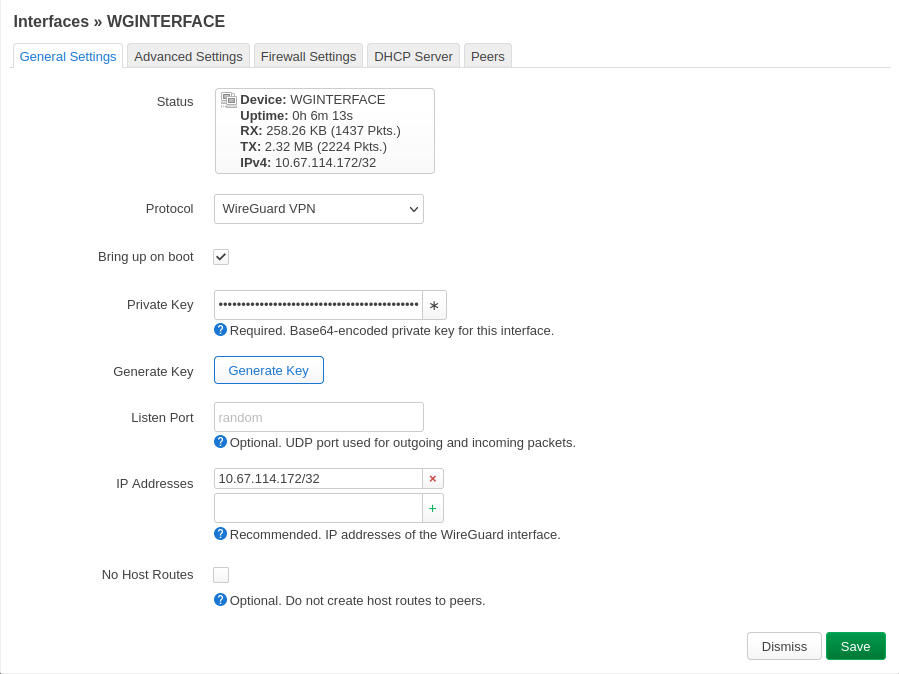
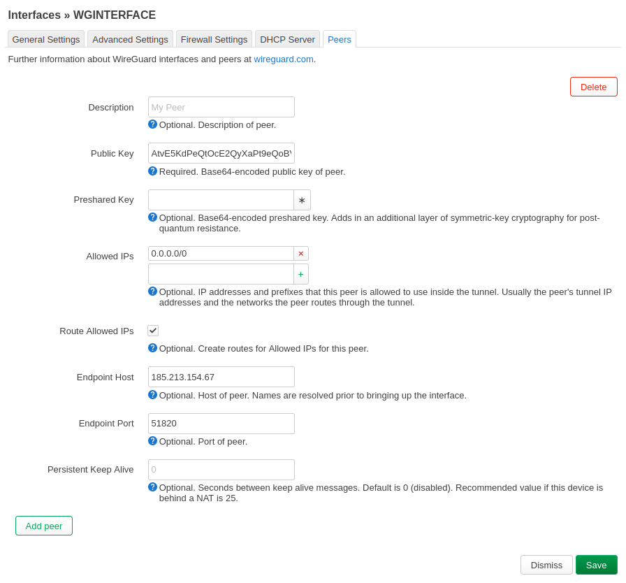
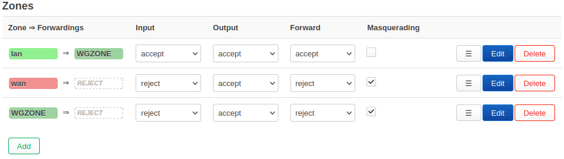
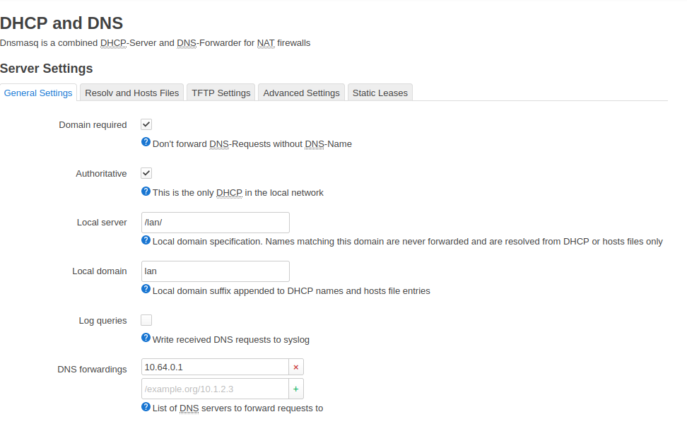

# opnwrt-mullvad configuration

**Installing WireGuard**

What you need in order to proceed:

A router with a fresh installation of OpenWrt.
A public/private key pair to use with WireGuard (will be described below).
An IP address to use (will be described below).
    
**Update the router's firmware to OpenWRT**

Follow your router's instructions on how to connect and update the firmware to the OpenWrt firmware that you previously downloaded.

The router normally displays some status information and then restarts. Take extra care in downloading the correct version since doing this incorrectly could "brick" your router, making it completely unusable.

**Initial configuration of OpenWrt**

Open a browser and navigate to http://192.168.1.1/.

Click the Login button. This logs you in with the default root user and no password.

Once the Status page loads, you will see a message at the top saying “No password set!” Click on System - Administration
On the Router Password page, set a secure password. Click the Save button.

On the same page, in the SSH Access section, set the interface to LAN. Click the Save & Apply button.

**Install WireGuard**

1. From the System drop-down menu, click on Software , Click **"Update lists..."**, then when finished updating click "Dismiss"

2. In the **Download and install package field** enter: **luci-proto-wireguard** and click OK, click Install. Then Dismiss the windows when installed. Repeat and make sure **wireguard-tools** is installed also.

3. Click System - Reboot (Make sure to reboot the router otherwise other steps will most likely fail)

**Public/private key pair**

If you do not have a public/private key pair to use with WireGuard, then you can use SSH to connect to the router as described earlier, and run:

```wg genkey | tee privatekey | wg pubkey > publickey```

Your public key will be in the file "publickey" and your private key in the file "privatekey".

Display the contents of publickey by issuing: ```cat publickey``` which is later used for pushing it to the api.
Display the contents of privatekey issuing: ```cat privatekey``` which is later used ```when``` configuring the WGInterface.

If you're running WireGuard on multiple devices, generate a separate key pair for each device. Also make sure to connect the router to a unique server that you do not use on other devices that will be using the router's VPN. You will otherwise run into connectivity issues.
Getting an IP to use with Mullvad

While connected to the router using ssh:

First install curl: ```opkg update && opkg install curl```

```curl https://api.mullvad.net/wg/ -d account=YOURMULLVADACCOUNTNUMBER --data-urlencode pubkey=YOURPUBLICKEY```

Replace the placeholders in the curl command above with your Mullvad account number and public key.

The IP:address to use with Mullvad will be returned.

**Add the WireGuard interface**

In the main menu, select Network- Interfaces and then click on "Add new interface". Name the interface  WGINTERFACE and select Protocol WireGuard VPN and press Create interface in order to start configure the new interface.

**Configure WGInterface settings**

Make the following changes:

  **Private Key** –  use the one you previously generated.
  
  **IP Addresses** – replace 10.67.114.172/32 with the IP address you received from Mullvadscreenshot of LEDE interfaces page



Click image to enlarge.

Click Peers, then Add Peer

  **Public Key** – use the key that corresponds with the Mullvad WireGuard server of your choosing from Servers
  
  **Route Allowed IPs** - Make sure this is checked
  
  **Endpoint Host (Peers)**– use the IP address that corresponds with the Mullvad WireGuard server of your choosing.
  
  **Endpoint Port** - change to 51820
  
  **Allowed IPs** - change to 0.0.0.0/0

interfaces-peers



Click image to enlarge.

Click on the Advanced Settings tab and check the box next to **"Force link"**. Leave the other options on this page as is (Setting does not exist on some versions)

Save and apply settings!
**Add new firewall zone**

From the Network drop-down menu, click on Firewall.

Under Zones. Create a new zone and set it up as shown below. We named ours "WGZONE".

**Input**: reject

**Output**: accept

**Forward**: reject

**Masquerading**: checked

**MSS clamping**: checked

**Covered networks**: WGINTERFACE
 
Click **Save**


Click on Edit the lan zone and set **"Allow forward to destination zones"** to WGZONE:WGINTERFACE" as the only option under allowed destinations.

 


Click image to enlarge.

**DHCP and DNS settings**

Under Network go to the DHCP and DNS settings.

Next to **DNS forwarding**, add 10.64.0.1

screenshot of LEDE DHCP and DNS settings page



Click image to enlarge.

**Change IP on LAN Interface (optional)**

If you have other routers in the network that use the IPs 192.168.0.1 or 192.168.1.1 then you can change the IP of the WireGuard router so they don't conflict.

Navigate to Network → Interfaces → LAN (click edit) and make the following changes:

  **IPv4 address** – change this to "192.168.99.1".

Keep in mind that after this you will need to access the OpenWRT router on the IP 192.168.99.1.

**Change DNS on LAN Interface**

Click on DHCP server - Advanced Settings - **DHCP-Options**: 6,10.64.0.1

If you'd like to learn more about DNS leaks, check out our guide on DNS leaks.

To use our filtering DNS, see Custom DNS entries for use with our VPN service.
Restart the router

In order to make everything start properly, restart the router. Some settings require you to restart the WGInterface in order for the changes to be applied. Sometimes you need to restart the router more than once!

**Add a watchdog (optional)**

Adding a watchdog will ensure that the router restarts if anything stops working.

Important: Complete this step only after you have confirmed that the router is working properly.

Use SSH to log in to the router and add the file wg-watchdog.sh (provided below) in /root using nano.

First install nano: ```opkg update && opkg install nano```

Then run the command ```nano /root/wg-watchdog.sh```

The wg-watchdog.sh file:

```
#!/bin/sh
# ping mullvad dns that can only be reached via the VPN tunnel
# if no contact, reboot!

tries=0
while [[ $tries -lt 5 ]]
do
        if /bin/ping -c 1 10.64.0.1
        then
                echo "wg works"
                exit 0
        fi
        echo "wg fail"
        tries=$((tries+1))
done
echo "wg failed 5 times - rebooting"
reboot
```

Make the file executable using the command ```chmod +x /root/wg-watchdog.sh```.

Afterward, add the following entry in System → Scheduled Tasks in LuCI:

```*/10 * * * * /root/wg-watchdog.sh```
